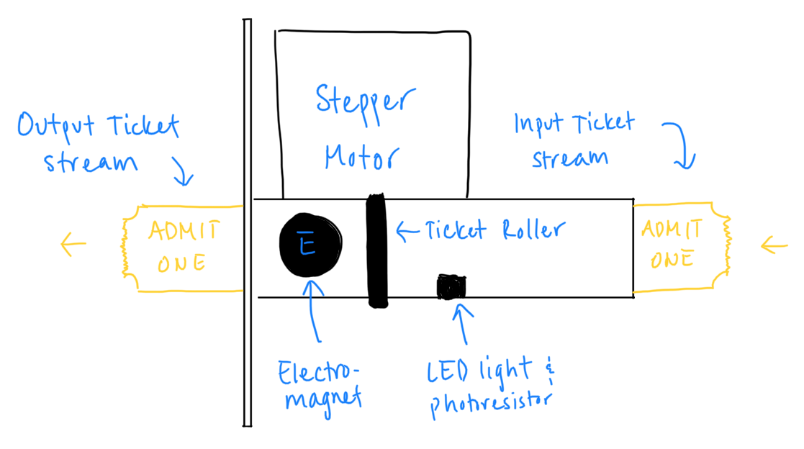

# Venmo Ticket Dispenser

Andrew Lu

ECE 251, Spring 2020, Professor Isukapalli.

[Venmo Ticket Dispenser repository on GitHub](https://github.com/andrewhlu/venmo-ticket-dispenser) - includes the Android app and all project documentation

[alu.moe repository on GitHub](https://github.com/andrewhlu/alu-moe) - includes the backend server, integrated into my (soon-to-be) personal website

---

## Overview

The goal of this project is to minimize the time spent waiting to purchase tickets at our cultural student organizations' annual night markets by automating digital wallet purchases using Android-based kiosks that can instantly detect and accurately dispense ticket purchases.

This idea was originally proposed for this year's TASA Night Market, which has unfortunately been cancelled due to the current situation. This idea is also based on a previous project in my freshman year where I created a web interface for using Venmo purchases to purchase items on e-commerce stores.

## Parts List

The following parts list reflects parts that will be used to build the application's accompanying ticket dispenser.

*This parts list is still a work in progress. Purchased quantities may be more than what is needed for the project.*

| Part | Quantity | Unit Price | Total Price |
|------|----------|------------|-------------|
| [Arduino Uno R3 Board](https://www.amazon.com/dp/B01EWOE0UU) | 1 | $12.99 | $12.99 |
| [(Pack of 4pcs) NEMA17 Stepper Motor High Torque Bipolar DC Step Motor Kit by MOTOU](https://www.amazon.com/dp/B07RZHWYQ9) | 1 | $33.88 | $33.88 |
| [BIQU A4988 Compatible StepStick Stepper Motor Diver Module with Heat Sink for 3D Printer Controller Ramps 1.4(Pack of 5pcs)](https://www.amazon.com/dp/B01FFGAKK8) | 1 | $8.99 | $8.99 |
| [HC-05 Wireless Bluetooth RF Transceiver](https://www.amazon.com/dp/B071YJG8DR) | 1 | $7.99 | $7.99 |
| Photoresistor | 1 | ? | ? |
| LED | 1 | ? | ? |

---

The original project proposal presentation can be found [here](proposal.pdf).

---

# Weekly Updates

## Week 6 Update (May 8)

This week was spent flushing out the project idea after an initial review by Professor Isukapalli. The project was presented near the end of class on Wednesday, May 6, and the project proposal slides can be found above.

The rest of this week was spent on getting a base Android application up and running. Since this app is intended to be used in a standalone kiosk environment, I spent a bit of time learning how to hide unnecessary components like the status bar and how to pin apps so they cannot be exited. Due to other projects and the BS/MS application, however, I was unable to spend any additional time working on the application.

## Week 7 Update (May 15)

I started this week by completing Homework 3. In doing so, I was able to learn how to make HTTP requests to endpoints, as well as continuously listen for responses, both of which are essential components to my application. My project will be set up in a similar fashion to that of Homework 3, where my application will be interfacing with a backend server that will handle the task of scraping the owner's Gmail account and parsing any Venmo entries.

After completing Homework 3, I focused my efforts on ordering the necessary parts for the ticket dispenser. I decided to keep the ticket dispenser simple and simply dispense tickets using one or two stepper motors, with a photoresistor to detect pulses in light that result from ticket edges passing by. I also decided to add an electromagnet to secure tickets from forcefully being pulled out. The parts have been ordered as of May 17th and should arrive within the next week.

Since the deadline for the BS/MS application was this week, I did not plan on working on the Android app this week. I will continue doing so next week, after my application has been submitted and I am able to catch up on my backlog of assignments.

## Week 8 Update (May 22)

I started to receive the parts I had ordered for the ticket dispenser. The first part I received was the electromagnet. Upon testing the electromagnet with the Arduino, however, I discovered that the electromagnet I had ordered did not have enough force to prevent tickets from being forcefully pulled out. Since I did not want to wait another week for shipping and spend more money testing electromagnets, I opted to forego the electromagnet, at least for the purposes of this class. When the opportunity arises to deploy this into the wild, I will most likely revisit this.

On the software side, I spent this week learning how to interface with the Gmail API. I looked into using the Gmail API from the following two standpoints:

* Call the Gmail API directly from the Android application itself
  * This method involves coding in Java using the [Java API library](https://developers.google.com/resources/api-libraries/documentation/gmail/v1/java/latest/)
* Call the Gmail API separately in a backend server, and have the Android application poll the server (similar to Homework 3)
  * This method would likely involve coding in JavaScript / Node.JS and use the [Node API library](https://googleapis.dev/nodejs/googleapis/latest/gmail/classes/Gmail.html)

While performing the email scraping directly in the application would allow the application to run standalone, I began to realize that scalability would be an issue. If this app were to be deployed for actual use at a night market, this app wouldn't be used alone, as there would likely be multiple instances of this app running concurrently, each on their own kiosk device. This would allow multiple people to line up and make their purchases in parallel, similar to a grocery store's "Self-Checkout" section. Requiring each instance of the app to parse emails individually would slow runtime on each device, and would likely eat up my Gmail quota, both of which are undesirable for this app. 

As a result, I opted to go for the Node backend method. While this does mean that you need a backend server configured to run this application (therefore removing its ability to be standalone), I can configure the backend to process each email only once, caching or storing the processed emails to be picked up later to reduce request times and minimize calls to the Gmail API. Since I already have experience using Node from personal projects and participating as an undergraduate lab assistant for CMPSC 48 this quarter, this change will also help me get up and running quicker and more efficiently. 

## Week 9 Update (May 29)

I received all the parts and spent the majority of this week assembling the ticket dispenser. I had originally hoped to create my own wood casing for my project, but I realized I lacked the tools to do so at home and do not have access to a lab, so I opted to make my project out of Styrofoam, paper, cardboard, and miscellaneous parts I scavenged from Daiso. Definitely not ideal for production, but it serves as a nice prototype. :)

Given the limited resources I have, I redesigned my ticket dispenser mechanism to work as follows:

* Note that the design still shows an electromagnet, but since I was unable to get it to work for the purposes of this class, it will be omitted from the final product.

On the software side, I worked on the implementation of the backend server that would parse my Gmail inbox for Venmo messages. I opted to use the same tech stack as [CMPSC 48](https://ucsb-cs48.github.io/) this quarter:

* [Next.js](https://nextjs.org/) - a React framework 
  * Note: I am only using the API endpoints feature for the purposes of this class and do not plan to create a web frontend. The decision to build my project using a React framework is to gain more familiarity with this framework, while giving myself the ability to add a website component to this application if this project does end up getting used in an actual night market.
* [Vercel (formerly Zeit)](https://vercel.com/) - a deployment platform for Next.js applications

My plan of action for implementing the backend is as follows:

1. Implement Google OAuth
2. Implement Firebase to store data
    * When choosing a database service, I was comparing Firebase and MongoDB.
    * Firebase was chosen over for MongoDB because it was easier to set up (in my opinion) and has a better integration with mobile apps, which I could later incorporate into my application if needed.
3. Implement Gmail API library and parse emails. 

Due to the time taken up by Homework 4 and my other final project, I was only able to complete up to step 2. I plan to spend the beginning of next week finishing up the backend.

## Week 10 Update (June 5)

I began this week by finishing the assembly of ticket dispenser and the development of the backend server. The code for the backend server can be seen in the [alu.moe repository](https://github.com/andrewhlu/alu-moe). Now that those are complete, I can dedicate the rest of my time to developing the Android application itself.

My plan of action for implementing the Android application is as follows:

1. Using GauchoPay from Homework 3 as a starting point, implement calls to the backend.
    * Includes: logging in, creating transactions, and updating transactions
2. Design the user interface to be clean, kiosk-like, and easily usable.
3. Implement UART communication over Bluetooth to connect to my Arduino ticket dispenser.
    * Implement UART communication in my ticket dispenser as well
    * Communicate the number of tickets to be printed out
4. Implement admin functionality, initially protected by a passcode
    * Ability to manually dispense tickets
    * Ability to manually print Venmo purchases without a transaction code
5. Implement NFC functionality to access admin settings

Due to my other final project, I am not able to spend much time on this early in the week, so progress will be limited for now. I will continue to work on this over the weekend and into next week, where I will post my final update.