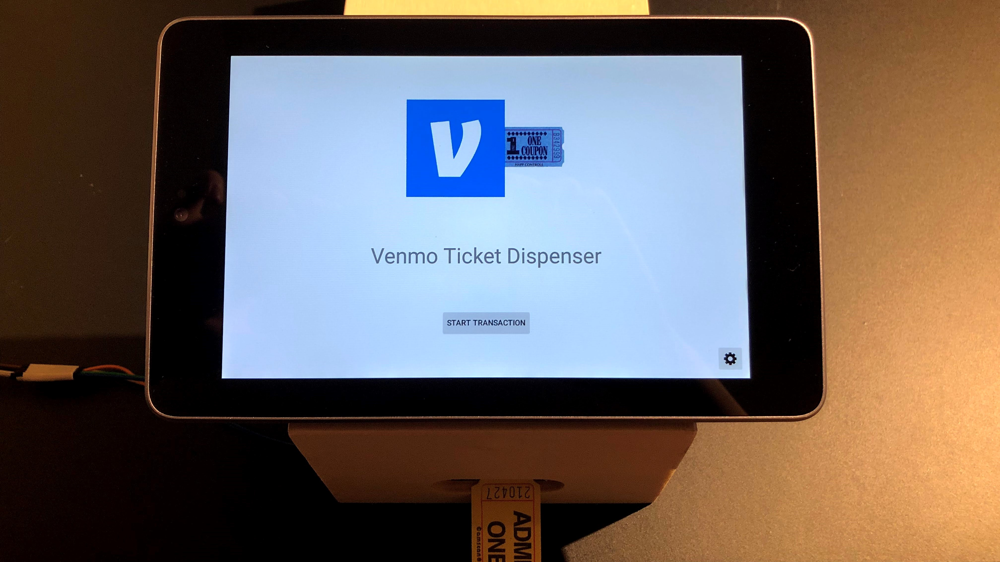
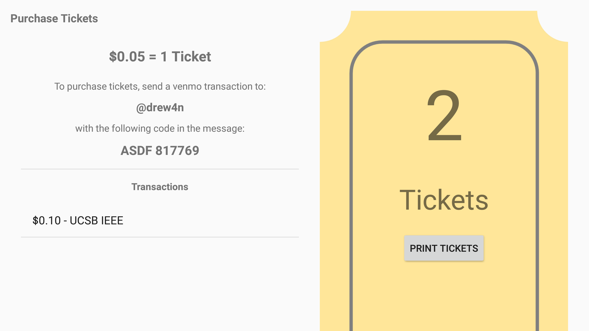
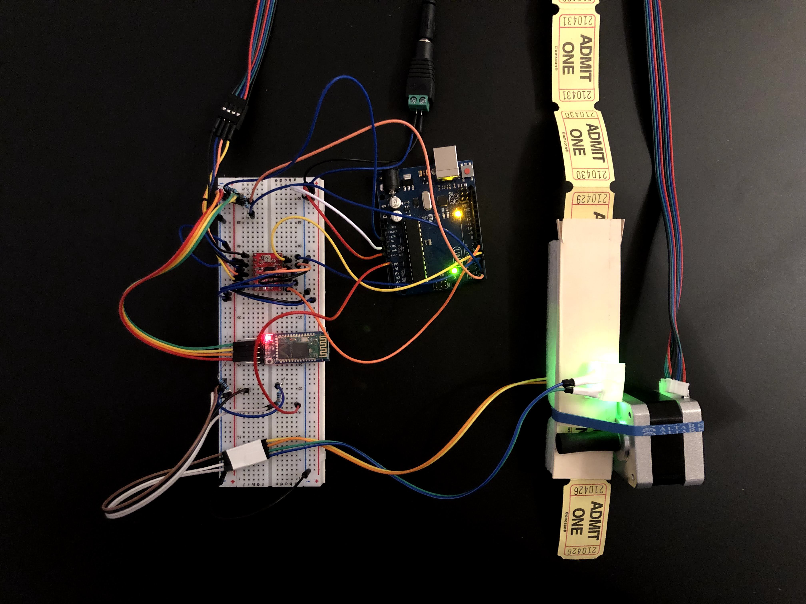
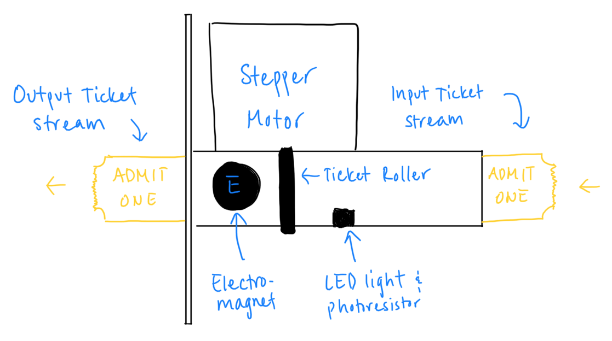

# Venmo Ticket Dispenser

Andrew Lu

ECE 251, Spring 2020, Professor Isukapalli.

[Venmo Ticket Dispenser repository on GitHub](https://github.com/andrewhlu/venmo-ticket-dispenser) - includes the Android app, Arduino code, and project documentation

[alu.moe repository on GitHub](https://github.com/andrewhlu/alu-moe) - includes the backend server, integrated into my (soon-to-be) personal website

---

Venmo Ticket Dispenser Demo Video: [https://youtu.be/lWllEX4snCA](https://youtu.be/lWllEX4snCA)

---

## Overview

The goal of this project is to minimize the time spent waiting to purchase tickets at our cultural student organizations' annual night markets by automating digital wallet purchases using Android-based kiosks that can instantly detect and accurately dispense ticket purchases.

This idea was originally proposed for this year's [TASA Night Market](https://www.facebook.com/events/242619546576980/), which has unfortunately been cancelled due to the current situation. This idea is also based on a previous project in my freshman year where I created a web interface for using Venmo purchases to purchase items on e-commerce stores.

## Parts List

The following parts list reflects parts that will be used to build the application's accompanying ticket dispenser.

| Part | Quantity | Unit Price | Total Price |
|------|----------|------------|-------------|
| [Arduino Uno R3 Board](https://www.amazon.com/dp/B01EWOE0UU) | 1 | $12.99 | $12.99 |
| [(Pack of 4pcs) NEMA17 Stepper Motor High Torque Bipolar DC Step Motor Kit by MOTOU](https://www.amazon.com/dp/B07RZHWYQ9)   * Only one of the four stepper motors is needed for this project | 1 | $33.88 | $33.88 |
| [BIQU A4988 Compatible StepStick Stepper Motor Diver Module with Heat Sink for 3D Printer Controller Ramps 1.4 (Pack of 5pcs)](https://www.amazon.com/dp/B01FFGAKK8)   * Only one of the five stepper motor driver modules is needed for this project | 1 | $8.99 | $8.99 |
| [HC-05 Wireless Bluetooth RF Transceiver](https://www.amazon.com/dp/B071YJG8DR) | 1 | $7.99 | $7.99 |
| [12V 2A DC Power Supply](https://www.amazon.com/dp/B00Q2E5IXW/) | 1 | $7.99 | $7.99 |
| [DC Power Cable Female Connector Plug (Pack of 10)](https://www.amazon.com/dp/B005CMP434/)   * Only one of the ten connector plugs is needed for this project | 1 | $5.87 | $5.87 |
| Photoresistor and LED | 1 | -- | -- |
| **TOTAL** (does not reflect partial quantities) |   |   | **$77.71** |

\* All prices are listed before taxes, tariffs, and shipping costs.

## Peripherals

The circuit for the Arduino-based ticket dispenser is shown below.

Important components:
* HC-05 module to communicate with the Android device over Bluetooth
* Stepper motor to roll out tickets as needed
* LED and photoresistor to detect light pulses from passing tickets to count dispensed tickets

## Arduino Pin Connections

* Digital 0: HC-05 Tx
* Digital 1: HC-05 Rx
* Digital 4: Stepper Motor Direction
* Digital 5: Stepper Motor Step
* Digital 6: Stepper Motor Enable
* Analog 0: Photoresistor

## Software Design

The app consists of three components:

* Android App
* Arduino Ticket Dispenser
* Node.js Backend

The Android app handles all user interface for this project, and serves as the middleman between the backend server and the ticket dispenser.

* When the app is launched, a service launches in the background that connects to the bluetooth ticket dispenser and awaits new requests to send messages.
* When a transaction is started, a POST request is made to my backend server to get a new transaction code and display it on the screen. While on the transaction screen, a thread in the background is consistently making GET requests to the backend server to retrieve new updates regarding the status of the transaction.
  * Because of this design, the app does not handle any transaction logic or searching of emails.
  * Shared Preferences are used to maintain the app's state, so this app can withstand crashes and naavigations away from the screen due to app closure or NFC card presence (see below).
* When the transaction is marked as completed, the app notifies the service via intents to print the specified number of tickets. The bluetooth sends the number over as a string, delimited by a period.
* The Application Settings menu and login activities are also pages that simply make API requests to the server.
* The Bluetooth Settings menu uses intents to start the Bluetooth service, stop the bluetooth service, and manually dispense tickets.
* The Security Settings menu uses shared preferences to store the settings passcode and list of NFC tags.
  * All settings on this activity (passcode and registered NFC tags) are unique to the device. I may look into changing this in the future - while this does provide more security (since passwords are never sent between devices), each device would have to be set up manually, and every NFC tag would have to be scanned on each device, which is a bad user experience design.
  * To allow the app to receive NFC events, the Security Settings activity is registered with the NFC intent, and is set to launch upon the detection of any MiFare Classic NFC tag. When the activity is launched, the serial number of the tag is validated against the ones in Shared Preferences.

The custom-built Arduino Ticket Dispenser is a standalone unit that can receive requests to dispense tickets.

* When the dispenser is plugged in, the Bluetooth module is initialized and starts looking for a connection.
* Communication over Bluetooth uses the UART protocol, and since this dispenser uses pins 0 and 1, the ticket dispenser uses the same UART stream as normal serial communication over USB. 
  * This means that this ticket dispenser could theoretically also be controlled over a wired USB connection without any changes to the code.

The Node.js backend handles all transaction logic and searching of Venmo emails.

* Venmo transactions are found by using the Gmail API to search a user's inbox for emails from `venmo.com`.
  * Venmo does not have a public API that developers can use.
* Unclaimed emails and all transaction data are stored in a Firebase Realtime Database.
  * This was chosen over MongoDB for the time being to give myself some flexibility if I wanted to incorporate database reads directly into my application.
* The decision to move all transaction logic and email searching to the backend was primarily based on scalability concerns. 
  * If this project were to be put to use in a real event, this application would most likely not be operating alone. There would be multiple instances of this application running, each on its own device and with its own ticket dispenser. If we searched emails directly on the devices, this would mean that every device would be making constant queries to the Gmail API, which will consume lots of bandwidth, increase processing time, and very quickly consume my API call limits. 
    * See Weekly Update 8 below

---

The original project proposal presentation can be found [here](proposal.pdf).

---

# Weekly Updates

## Week 6 Update (May 8)

This week was spent flushing out the project idea after an initial review by Professor Isukapalli. The project was presented near the end of class on Wednesday, May 6, and the project proposal slides can be found above.

The rest of this week was spent on getting a base Android application up and running. Since this app is intended to be used in a standalone kiosk environment, I spent a bit of time learning how to hide unnecessary components like the status bar and how to pin apps so they cannot be exited. Due to other projects and the BS/MS application, however, I was unable to spend any additional time working on the application.

## Week 7 Update (May 15)

I started this week by completing Homework 3. In doing so, I was able to learn how to make HTTP requests to endpoints, as well as continuously listen for responses, both of which are essential components to my application. My project will be set up in a similar fashion to that of Homework 3, where my application will be interfacing with a backend server that will handle the task of scraping the owner's Gmail account and parsing any Venmo entries.

After completing Homework 3, I focused my efforts on ordering the necessary parts for the ticket dispenser. I decided to keep the ticket dispenser simple and simply dispense tickets using one or two stepper motors, with a photoresistor to detect pulses in light that result from ticket edges passing by. I also decided to add an electromagnet to secure tickets from forcefully being pulled out. The parts have been ordered as of May 17th and should arrive within the next week.

Since the deadline for the BS/MS application was this week, I did not plan on working on the Android app this week. I will continue doing so next week, after my application has been submitted and I am able to catch up on my backlog of assignments.

## Week 8 Update (May 22)

I started to receive the parts I had ordered for the ticket dispenser. The first part I received was the electromagnet. Upon testing the electromagnet with the Arduino, however, I discovered that the electromagnet I had ordered did not have enough force to prevent tickets from being forcefully pulled out. Since I did not want to wait another week for shipping and spend more money testing electromagnets, I opted to forego the electromagnet, at least for the purposes of this class. When the opportunity arises to deploy this into the wild, I will most likely revisit this.

On the software side, I spent this week learning how to interface with the Gmail API. I looked into using the Gmail API from the following two standpoints:

* Call the Gmail API directly from the Android application itself
  * This method involves coding in Java using the [Java API library](https://developers.google.com/resources/api-libraries/documentation/gmail/v1/java/latest/)
* Call the Gmail API separately in a backend server, and have the Android application poll the server (similar to Homework 3)
  * This method would likely involve coding in JavaScript / Node.JS and use the [Node API library](https://googleapis.dev/nodejs/googleapis/latest/gmail/classes/Gmail.html)

While performing the email scraping directly in the application would allow the application to run standalone, I began to realize that scalability would be an issue. If this app were to be deployed for actual use at a night market, this app wouldn't be used alone, as there would likely be multiple instances of this app running concurrently, each on their own kiosk device. This would allow multiple people to line up and make their purchases in parallel, similar to a grocery store's "Self-Checkout" section. Requiring each instance of the app to parse emails individually would slow runtime on each device, and would likely eat up my Gmail quota, both of which are undesirable for this app. 

As a result, I opted to go for the Node backend method. While this does mean that you need a backend server configured to run this application (therefore removing its ability to be standalone), I can configure the backend to process each email only once, caching or storing the processed emails to be picked up later to reduce request times and minimize calls to the Gmail API. Since I already have experience using Node from personal projects and participating as an undergraduate lab assistant for CMPSC 48 this quarter, this change will also help me get up and running quicker and more efficiently. 

## Week 9 Update (May 29)

I received all the parts and spent the majority of this week assembling the ticket dispenser. I had originally hoped to create my own wood casing for my project, but I realized I lacked the tools to do so at home and do not have access to a lab, so I opted to make my project out of Styrofoam, paper, cardboard, and miscellaneous parts I scavenged from Daiso. Definitely not ideal for production, but it serves as a nice prototype. :)

Given the limited resources I have, I redesigned my ticket dispenser mechanism to work as follows:

* Note that the design still shows an electromagnet, but since I was unable to get it to work for the purposes of this class, it will be omitted from the final product.

On the software side, I worked on the implementation of the backend server that would parse my Gmail inbox for Venmo messages. I opted to use the same tech stack as [CMPSC 48](https://ucsb-cs48.github.io/) this quarter:

* [Next.js](https://nextjs.org/) - a React framework 
  * Note: I am only using the API endpoints feature for the purposes of this class and do not plan to create a web frontend. The decision to build my project using a React framework is to gain more familiarity with this framework, while giving myself the ability to add a website component to this application if this project does end up getting used in an actual night market.
* [Vercel (formerly Zeit)](https://vercel.com/) - a deployment platform for Next.js applications

My plan of action for implementing the backend is as follows:

1. Implement Google OAuth
2. Implement Firebase to store data
    * When choosing a database service, I was comparing Firebase and MongoDB.
    * Firebase was chosen over for MongoDB because it was easier to set up (in my opinion) and has a better integration with mobile apps, which I could later incorporate into my application if needed.
3. Implement Gmail API library and parse emails. 

Due to the time taken up by Homework 4 and my other final project, I was only able to complete up to step 2. I plan to spend the beginning of next week finishing up the backend.

## Week 10 Update (June 5)

I began this week by finishing the assembly of ticket dispenser and the development of the backend server. The code for the backend server can be seen in the [alu.moe repository](https://github.com/andrewhlu/alu-moe). Now that those are complete, I can dedicate the rest of my time to developing the Android application itself.

My plan of action for implementing the Android application is as follows:

1. Using GauchoPay from Homework 3 as a starting point, implement calls to the backend.
    * Includes: logging in, creating transactions, and updating transactions
2. Design the user interface to be clean, kiosk-like, and easily usable.
3. Implement UART communication over Bluetooth to connect to my Arduino ticket dispenser.
    * Implement UART communication in my ticket dispenser as well
    * Communicate the number of tickets to be printed out
4. Implement admin functionality, initially protected by a passcode
    * Ability to manually dispense tickets
    * Ability to manually print Venmo purchases without a transaction code
5. Implement NFC functionality to access admin settings

Due to my other final project, I am not able to spend much time on this early in the week, so progress will be limited for now. I will continue to work on this over the weekend and into next week, where I will post my final update.

## Week 11 Update (June 12)

Over the weekend, and up until Wednesday morning, I spent all my time working on the plan of action I had devised the week before. 

I started by first designing all the activity layouts and transitions, polishing the user interface until I got approval from others that the interface was clean and intuitive. After the user interface was done, I added support for all the API calls to my backend server. With the help of Homework 3, this was fairly trivial, though I did have to spend some time learning how to manipulate JSON objects in Java and add a JSON string to the body of a POST request.

Once the API endpoints were handled, I moved onto getting Bluetooth communication to work. Thanks to a Stack Overflow post I had found (linked within the code), I was able to analyze how an existing Bluetooth terminal app worked, and incorporate the components I needed to send data over UART to Bluetooth. I had originally hoped to incorporate the Bluetooth connection logic in the same Java class that handled the "Complete Transaction" API endpoint, but I consistently ran into issues when making multiple transactions since I had initiated a new Bluetooth connection with each API call. As a result, I decided to abstract it out into its own service, which now launches on app start and runs in the background.

Once Bluetooth communcation was added, the last component to incorporate was NFC. This was the step where I had the most trouble, since the Android developer documentation did not have much details about how to implement the feature, and Stack Overflow posts were heavily outdated. While testing out some other NFC tool apps on the Play Store, however, I discovered that you can add properties to your application's manifest file to launch a specific activity on the presence of a specific type of NFC tag. I used the NFC tool apps to discover what type of NFC tags I had (MiFare classic), and registered the security settings activity to launch whenever such a tag was detected. Using intent data, I was able to grab each tag's serial number, which was then stored in a StringSet shared property that could be validated later on.

On Wednesday morning, I attempted to demonstrate my app live on the Zoom call. Unfortunately, it failed, and this was actually the first time I had seen the application fail at all. I was able to trace this back to an error in my backend, and when I redeployed the backend immediately after the demo, it seemed to work smoothly again. I wish I was able to give a nice live demonstration, but this held me back and I wasn't able to show anything in the end. However, I did film a comprehensive video demo after, which is now viewable on the top of this website.

I shared this video with the staff of the TASA night markets, and received an overwhelmingly postive response! If we are able to host the night market again next year, they will definitely look into funding the production of more ticket dispensers :)

## Future Improvements

This app and ticket dispenser was a nice proof-of-concept, but it is still far from being ready for a production environment. 

These are some of the features I hope to add or update in future iterations, in no particular order:

* Ability to manually associate Venmo emails to app transactions as an admin setting
  * This would be useful if a user forgot to enter the code in their transaction body or mistyped it.
* Viewable transaction history
  * The transactions are retained in the database, but there currently isn't a way to view them in the app.
  * Transaction statistics would be nice as well, so an event organizer could see how many tickets were sold in a given day, etc.
* Better app security
  * Currently, access tokens are set in plaintext as a GET request parameter. Since my access tokens don't expire, if someone found an access token, they could use it as well, and no one would know.
  * In addition, passcodes and registered NFC tags are currently local to each device. It would be nice if this could be securely replicated on each device using the same account.
* Web interface to manage application instances and remotely oversee devices
* iOS port of the app
  * Android is a nice development platform, but there is a large amount of variance between the devices. It would be nice if I could create a version of this app for iOS devices (iPads specifically), since these are generally more popular and are more streamlined. 
* NFC integrated into the ticket dispenser instead of through the device
  * In today's Android tablet market, it's hard to find a tablet that supports NFC, let alone finding one that supports all NFC technologies available. I was lucky enough to have my very old Nexus 7 laying around, which was the only Android device I had that could support all NFC tag types, despite being the oldest Android device I owned.
    * Fun fact: the Nexus 7 is the tablet of choice for many restaurant reward systems as well (e.g. Fivestars), because of the support for NFC tags.
  * Because of the variance in devices, it would be nice to implement an NFC reader into the ticket dispenser itself, so any device can use NFC features, even if it doesn't have an NFC sensor itself (especially iOS devices, if I were to make a port).
